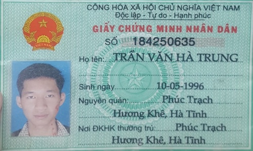
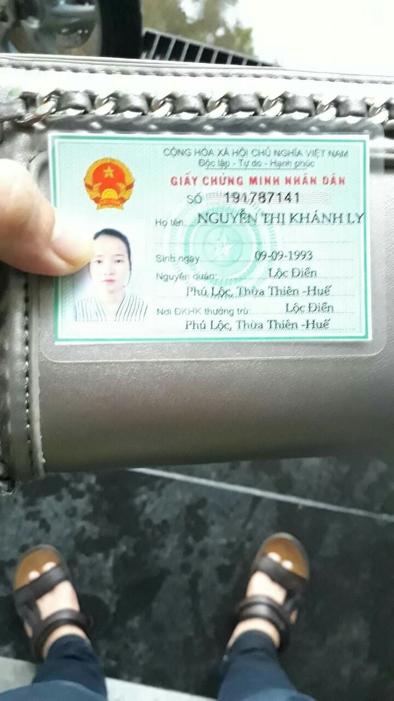
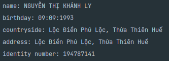
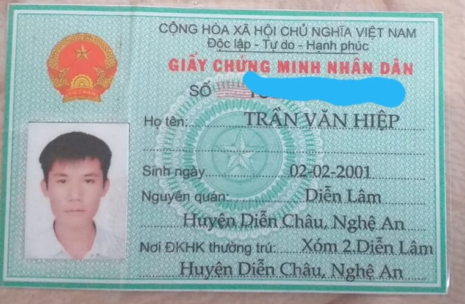
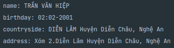
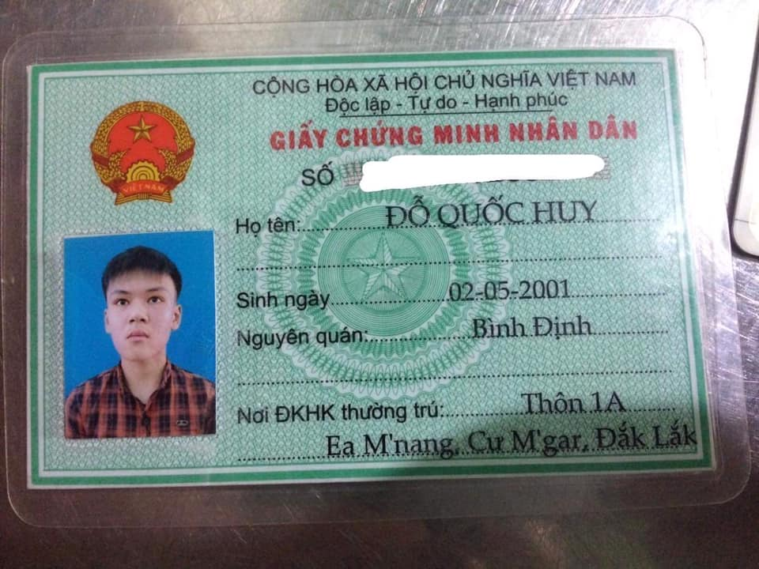
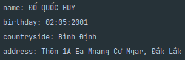
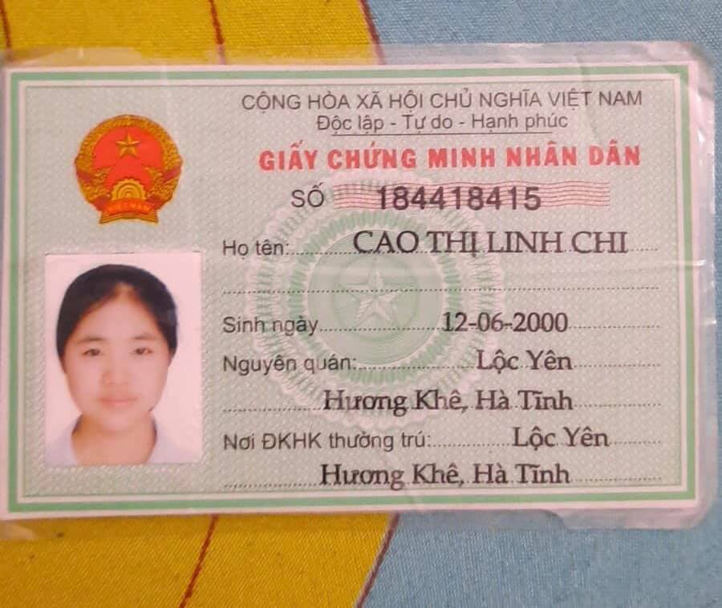
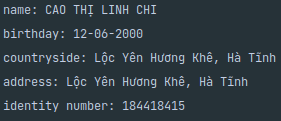

# Identity Card Information Extraction

## Introduction

This project is used for demonstrating the potential of OCR in extracting the data from any types of card. For the demo purpose and limited data, I only try with Vietnamese identity cards, which were collected from the community includes who lost their identity card and are seeking for it.

The pipeline of this project consists of 3 steps:
1. Detect 4 corners of the card, warp them in a straight alignment
2. Use class segmentation to extract the boundary of each type of info
    - identity number
    - name
    - birthday
    - countryside
    - current address
3. Use OCR to read the text inside these boundaries
4. (Optional) Extract feature from `countryside` and `current address`, generate a feature vector and compare it to feature vectors of every city / province in Vietnam (using Cosine or Euclidean Distance) to get the closest site.


## Dataset

- The dataset includes 200 images for detecting corner (work pretty good).
- It includes only 300 images for segmenting info.


## Prerequisites

- Anaconda
- Python


## Installation steps:

```shell
git clone https://github.com/tailtq/identity-card-info-extraction
cd identity-card-info-extraction
conda create -n id-info-extraction python=3.6
pip install -r requirements.txt

# gdown doessn't work well, so please download models manually from https://drive.google.com/uc?id=17p8ehFmn-RqzvtK3sEUf3WRMWZ-xsuT-
# Then unzip
unzip id-info-extraction.zip
``` 

## Run

```shell
python segment_info.py images/test.jpg  # identity card link
```

## Train

I use these below classes to train id card alignment model using [YOLOv5](https://github.com/ultralytics/yolov5) model and format. Please refer to my `train-id-card-alignment.ipynb` for more information.
- top left
- top right
- bottom right
- bottom left

For training segmentation model, you have to generate the correct label for each image. Each type of information will be drawn in a black image, with each pixel equals its class number. For example:

Image:



Label:


(Label pixel values range from 1-5, 0 is background)

Please refer to `train-info-segmentation.ipynb` for more information.

## Results

Image 1:




---

Image 2:




---

Image 3:




---

Image 4:





## Problems

- The segmentation dataset is very limited and can't cover all cases (scan images,...).
- I used pre-trained VietOCR (a famous model for extracting Vietnamese text), and the dataset does not have a font in the old identity card. So the performance would be relatively low.
- Punctuation isn't well extracted by OCR model.
- A minority of cards having a great amount of text were printed intrusively with avatar.

## Solutions

- Gather more identity cards. In my opinion, the least amount should be 2000 images to train a good model.
- Collect more text data and synthesize new data based on the fonts for OCR model.
- Remove blur and low resolution images.
